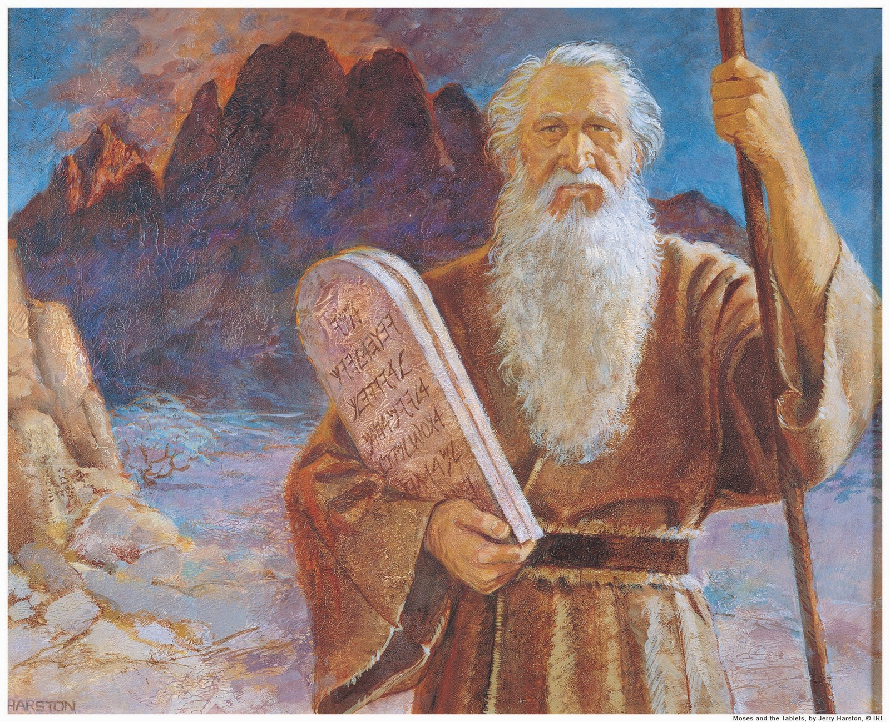

# Moisés

Nada

### Nacimiento

La historia de Moisés comienza a ser contada en la Biblia en el libro de Éxodo, en el Capítulo 2. Moisés fue elegido por Dios para sacar al pueblo de Israel de la esclavitud de Egipto.

Cuando Moisés nació, el Faraón había dado orden para matar a todas las guaguas que fueran hijos de los israelitas. El Faraón tenía miedo de una revuelta, pues el pueblo de Israel estaba aumentando.

Para no ver a su hijo muerto, la madre de Moisés, colocó a su pequeña guagua en una canasta de mimbre y lo soltó en un río, con su hermana cerca, a la orilla del río a vigilar.

Sucedió que la hija de Faraón, que se bañaba en el río, encontró la canasta y vio que tenía un niño llorando dentro de ella. Con compasión, decidió quedarse con el niño, pero necesitaba de alguien para amamantarlo. Fue entonces que Miriam, la hermana de Moisés se ofreció para arreglar a alguien que cuidara a la guagua y corriendo, sin que la hija de Faraón supiera, trajo a la propia madre de Moisés para cuidar al niño.

Siendo Moisés ya un niño grande, fue devuelto a la Hija del Faraón que lo adoptó y le dio este nombre, que significa que de las aguas había sido quitado.

### Encuentro con Dios

Siendo Moisés ya adulto, y sabiendo que no era hijo de la hija de Faraón, una vez se irritó al ver un Egipcio golpeando a un hebreo y, teniendo un acceso de ira, acabó por matar al Egipcio. Por esta razón el Faraón se volvió contra Moisés que acabó huyendo de Egipto para no ser muerto.

Pero Dios ya había preparado el destino de Moisés y después de algún tiempo, se le apareció en una zarza ardiente \(una especie de arbusto ardiendo, pero que no se consumía\). Fue allí donde Dios se reveló y entregó a Moisés la misión de volver a Egipto y convencer al Faraón para que liberara al pueblo de Israel.

Como esta no era una tarea fácil, Dios le dio a Moisés señales de que él no estaba solo, Dios estaría con él, y estas señales servirían para que el pueblo y el Faraón creyeran que lo que Moisés decía era verdad, esto después de haber convencido a Dios el propio Moisés, que no creía ser capaz de hacer tal tarea.

### Las diez plagas

Al llegar al Faraón, Moisés comenzó su trabajo. Conforme Dios mandó, Moisés lanzó su vara al suelo y ella se transformó en una serpiente. Entonces el Faraón llamó a sus hechiceros, que hicieron lo mismo, pero la serpiente de Moisés tragó las serpientes de los hechiceros de Faraón. Pero esto no convenció a Faraón, que por no creer en Moisés, mandó aumentar el castigo sobre el pueblo de Israel.

Más tarde, Moisés continúa su tarea tratando de convencer al Faraón y nuevamente usa los signos dados por Dios, esta vez lanza plagas sobre Egipto, que sucedieron en el siguiente orden:

* Transformó las aguas de Egipto en sangre;
* Ha llenado el Egipto de ranas;
* Llena al pueblo de Egipto de piojos;
* Después la plaga de las moscas;
* Después la plaga de las enfermedades de los animales de los Egipcios;
* Luego lanzó sarnas que se volvían úlceras sobre los Egipcios;
* Todavía la plaga del granizo de fuego que quemaba todo sobre Egipto;
* Después la plaga de las langostas;
* Y la plaga de la oscuridad, que dejó a los egipcios prácticamente ciegos por 3 días.

### Liberación de Egipto

Sólo entonces el corazón del Faraón se ablandó y dejó el pueblo de Israel salir de Egipto. Pero Dios aún dio otro castigo al Faraón y a su pueblo, incluso después de dejar Israel partir, y vino sobre Egipto otra plaga que hirió con la muerte a todos los primogénitos \(los hijos varones mayores de cada familia\).

Para conmemorar esta victoria, Dios ordenó al pueblo de Israel que se hiciera una fiesta en forma de culto de agradecimiento y dio a esta fiesta el nombre de Pascua.

Con todo eso, el Faraón aún no se rindió y persiguió al pueblo de Israel hasta cerca de ellos frente al Mar Rojo. Entonces, una vez más Dios actuó, abriendo el mar para que su pueblo pasara y cerrar de nuevo cuando el ejército de Faraón intentó atravesar, matando a todos sus soldados ahogados.

### La tierra prometida

Moisés continuó su misión de llevar al pueblo de Dios hasta la tierra prometida. En el camino por el desierto, el pueblo recibió los 10 mandamientos dados por Dios. Pasaron sed y hambre y hubo una roca que vertió agua y el maná que cayó del cielo. Moisés llegó a la tierra prometida, pero no llegó a pisarla.

