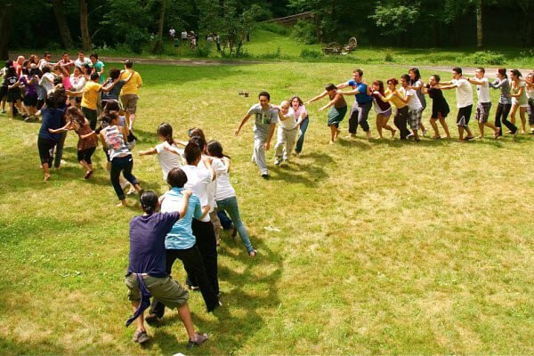

# Atrapar la cola del dragón

Este es un juego tradicional chino en el que los niños interpretan a uno  de sus dragones tradicionales. Se sortea la persona que hará de cabeza y  luego los demás hacen una fila detrás de él, colocando sus brazos  extendidos sobre los hombros del niño que tienen delante. El último será  la cola del dragón.

La cabeza tendrá que correr para atrapar la cola. Esto no será nada  fácil, teniendo en cuenta que los niños no deben soltarse. Si la cabeza  atrapa a la cola podrá seguir en su sitio. Si el cuerpo se rompe, la  cabeza pasará a la cola y el siguiente niño hará de cabeza.

