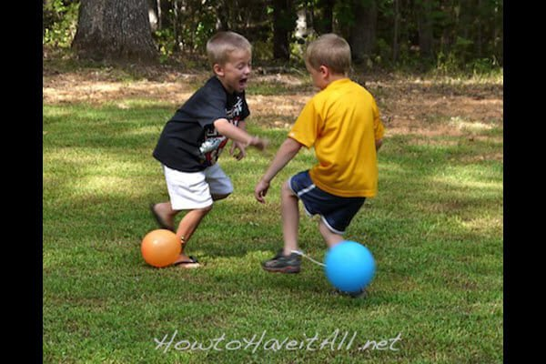

# Pisa el globo

Se necesita un globo y un poco de cuerda para cada participante. Con la cuerda, los jugadores deberán atarse el globo a sus tobillos. El juego consiste en pisotear los globos de los demás, evitando que pisoteen el nuestro. El portador del último globo que no haya sido explotado será el ganador.

