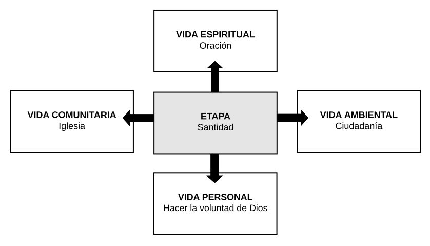

# 4º Medio - Recomenzar

## Prepararse para algo nuevo

Cuarto medio es un año de transición hacia algo nuevo que es el mundo universitario. En el centro de la preocupación del grupo debe estar mantenerse unidos en esta transición que es una nueva aventura. Diferentes escenarios pueden pasar en este tiempo: por un lado, puede ser un año muy rico para mirar y agradecer por el camino recorrido como grupo y, por otro, puede ser un año de no sentirse parte de nada y andar a la deriva sin rumbo. Todo depende de la forma como el grupo esté preparado para volver a definir su proyecto en base a las buenas experiencias que han acumulado y a la confianza que han adquirido.

El encargado debe recordar al grupo que la vida no es estática sino un proceso de crecimiento permanente que tiene etapas. Una tentación latente en este proceso de transición es despedirse anticipidamente de la Rama de los Pioneros, cosa que pode acrecentar el sentimiento de no pertenencia y quedar en el aire. Es un desafío encontrar formas de participación adecuada en la Rama, a través de aportes puntuales y la autoridad moral, sabiendo que "Pionero que pisa el Colegio es todavía Pionero". Lo más importante es entrar en la dinámica de la gratitud respecto del camino recorrido y ponerse de acuerdo para seguir adelante con mucha esperanza porque se viene algo nuevo y muy bueno, la Rama de los Universitarios.

| **4º MEDIO** | **Recomenzar - Prepararse para algo nuevo** |
| --- | --- |
| **Proyecto principal** | • Volver a las raíces: Historia del Grupo |
| **Crecimiento del grupo** | • Jornada larga de evaluación de los Pioneros, el camino recorrido |
| **Crecimiento en la Rama** | • Valorar todos los aportes que se puedan dar como hermanos mayores |
| **Actividades** | • Visita de los Universitarios \(hacia final de año\) |

