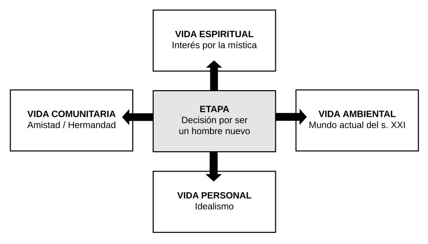

# 8º Basico - Idealismo

## Introducción a los Pioneros

Es el año de la llegada a los Pioneros. Todo es una novedad. Para los que llegan de los Cruzados, algunos ya un poco saturados, es el momento de sentir que puedo hacer lo que me de la gana con mis amigos y vivir una mística de grupo especial de cumplicidad y hermandad, sobretodo en las jornadas, pero sobretodo que se construye a través de una amistad afuera de las reuniones.

Cabe al encargado mostrar el sentido de esa libertad, retando en el sentido de los más elevados ideales que están simbolizados en la Bandera, el Código del Hombre Nuevo y en la oración del Pionero. El Hombre Nuevo es Jesús, nuestro modelo, y María es nuestra Madre, la que nos ayuda en esa conquista de la auténtica libertad.

