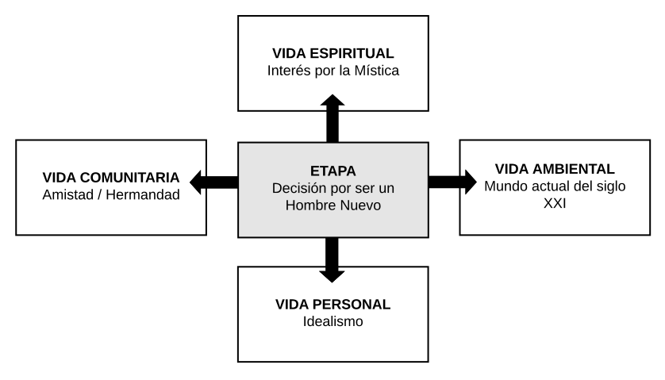

# 8º Basico - Idealismo

## Introducción a los Pioneros

Es el año de la llegada a los Pioneros. Todo es una novedad. Para los que llegan de los Cruzados, algunos ya un poco saturados, es el momento de sentir que puedo hacer lo que me de la gana con mis amigos y vivir una mística de grupo especial de cumplicidad y hermandad, sobretodo en las jornadas, pero que se construye a través de una amistad afuera de las reuniones.

Cabe al encargado mostrar el sentido de esa libertad, retando en el sentido de los más elevados ideales que están simbolizados en la Bandera, el Código del Hombre Nuevo y en la oración del Pionero. El Hombre Nuevo es Jesús, nuestro modelo, y María es nuestra Madre, la que nos ayuda en esa conquista de la auténtica libertad.

| **8º BASICO** | **Idealismo - Introducción a los Pioneros** |
| --- | --- |
| **Proyecto principal** | • Jornada de grupo. Si posible en una casa fuera de la ciudad |
| **Crecimiento del grupo** | • El grupo tiene un coordinador |
| **Crecimiento en la Rama** | • Tener amigos |
| **Actividades** | • Visitar las casas unos de otros • Construir cosas manualmente: símbolos |
| **Mística** | • Bandera, Oración del Pionero, Código del Hombre Nuevo |
| **Schoenstatt** | • Acta de Pre-fundación • Heroes, Congregados • Historia del Padre Kentenich |
| **Otros temas** | • ¿Cómo es el mundo de hoy? ¿Qué significa ser cristiano en este mundo? • ¿Qué es la libertad? Hombre masificado vs. Hombre libre • Amistad |
| **Catequesis** | • Biblia en general • Año liturgico: Cuaresma / Adviento |
| **Testimonios** | • Proyectos realizados por la Rama • Visita del Consejo |

